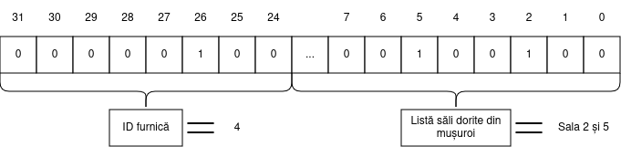

# Tema 2 - Intrusion Detection with Suricata

**Responsabili**
- Florin Postolache
- Răzvan Vîrtan
- Mircea Preoteasa
- Rareș Constantin

---

Suricata Zoly a exagerat în ultimele săptămâni cu pasiunea ei pentru programarea funcțională.
Ca urmare, a fost izolată de tribul ei și trebuie să își găsească o nouă casă alături de alte animale din habitat.
Pentru a nu fi considerată însă un intrus în noile vizuini, fiecare tovarăș animal îi cere lui Zoly să rezolve anumite task-uri în limbaj de asamblare.
Sarcina voastră în cadrul acestei teme este să o ajutați pe Zoly să își găsească o nouă casă.

<div align="center">
    
</div>

**Zoly vă sfătuiește să rezolvați tema pe mașina virtuală de PCLP2 / IOCLA.**
**Dacă lucrați pe alt sistem (WSL, Linux nativ), vă sfătuiește să testați rezolvarea și pe VM-ul de PCLP2.**

---
## Task 1 - Permissions (15p)

Pentru a strânge niște bani de buzunar și de călătorie, Zoly a acceptat un job la negru de la vecinele sale furnicile.

<div align="center">
    
</div>

Job-ul constă în crearea unei funcții care verifică dacă o anumită furnică are voie să rezerve sălile pe care le dorește din mușuroi.

Mușuroiul are 24 de săli, numerotate de la **0 la 23**.

Pentru a-i ușura treaba lui Zoly, aceasta are la dispoziție o listă în care se specifică sălile pe care fiecare furnică le poate rezerva.
Lista este reprezentată de vectorul global de întregi `ant_permissions[]`, aflat în fișierul `constants.h`. Acest vector poate fi accesat din fișierul `check_permission.asm` cu ajutorul label-ului `ant_permissions`.
Elementul de la poziția `i` din vector reprezintă lista de săli pe care furnica cu id-ul `i` le poate accesa.
Atunci când bitul `j` are valoarea `1` în elementul de la poziția `i`, furnica cu id-ul `i` poate accesa sala `j`.

**Observație** Din moment ce avem doar 24 de săli, asta înseamnă că cei mai semnificativi 8 biți ai fiecărui element din `employee_permissions[]` vor fi mereu 0.

Funcția pe care Zoly trebuie să o implementeze are antetul de mai jos.

```c
void check_permission(unsigned int n, unsigned int *res);
```

**Primul argument** (`n`) este un întreg pe 32 de biți.
Primii 8 cei mai semnificativi biți din cadrul numărului reprezintă identificatorul `i` al furnicii.
Restul de 24 de biți au următoarea semnificație: bitul `j` ne spune dacă furnica `i` dorește să rezerve sala `j`.
O furnică poate cere să rezerve mai multe săli simultan.
Figura de mai jos ilustrează formatul acestui argument.

<div align="center">
    
</div>


**Al doilea argument** (`res`) reprezintă adresa de memorie la care funcția trebuie să scrie rezultatul verificării. Dacă furnica cu identificatorul `i` poate rezerva toate sălile dorite, valoarea `1` trebuie scrisă la adresa `res`. Dacă furnica nu poate rezerva una sau mai multe din sălile dorite, valoarea `0` trebuie scrisă la adresa `res`.

Funcția trebuie completată în cadrul fișierului `check_permission.asm`.
## Task 2 - Requests (20p)

Pentru a intra în tribul lui, ratonul inginer îi cere lui Zoly să implementeze un sistem de login.

<div align="center">
    
</div>

Se dau structurile simplificate ale unui login request:

```c
    struct creds {
        unsigned short passkey;
        char username[51];
    };

    struct request {
        unsigned char admin;
        unsigned char prio;
        struct creds login_creds;
    };
```

### Exercițiul 1 (10p)

Pentru această parte a task-ului, aveți de implementat funcția `sort_requests()` în fișierul *subtask1.asm*.
Această funcție va simula sortarea tuturor request-urilor de login.

Pentru a ințelege mai bine cum funcționează un login request, vom explica mai jos ce înseamnă fiecare field al structurilor:

- `admin` ne spune dacă request-ul e făcut de un admin
- `prio` reprezintă prioritatea pe care o are un request
- `creds` reprezintă o structură de tip creds
- `passkey` reprezintă passkey-ul necesar ca login-ul să fie realizat
- `username` reprezintă un string de identificare unic pentru fiecare request

Pentru a sorta request-urile, stabilim următoarele reguli:

- Request-urile trebuie să fie sortate astfel încât request-urile făcute de admini să fie primele.
- Request-urile trebuie sortate după prioritate; prioritatea reprezentată de un număr mai mic e mai "mare".
- Request-urile cu aceeași prioritate trebuie apoi sortate alfabetic dupa username.

Sortarea se va face **in place**, adică vectorul `requests` prezentat mai jos va trebui, în urma apelului funcției, să fie sortat.

Antetul funcției este:

```c
void sort_requests(struct request *requests, int len);
```

Semnificația argumentelor este:

- **requests:** adresa de început a vectorului de request-uri
- **len:** numărul de request-uri

**Atenție!** Nu puteți folosi funcții externe pentru a sorta vectorul sau pentru a compara username-urile.


### Exercițiul 2 (10p)

În continuarea exercițiului 1, acum trebuie să implementați funcția `check_passkeys()` în fișierul *subtask2.asm*.
Această funcție va verifica dacă passkey-ul din interiorul request-ului este unul corect, care nu e asociat unui hacker.

Suricata Zoly s-a prins de faptul că există și niște hackeri care vor să spargă sistemul, dar și de metoda prin care vor să păcălească login-ul.
Aceștia setează mereu primul bit și ultimul bit din `passkey`, iar pentru cei 14
biți rămași fac următoarele:

- pentru cei mai puțin semnificativi 7 biți: număr par de biți de `1`
- pentru cei mai semnificativi 7 biți: număr impar de biți de `1`

**Exemplu:**
```
    1000 1110 0110 0001 => hacker
```

Va trebui să puneți valorile obținute în vectorul `connected[]` prezentat mai jos.
Veți pune `0` pentru request-urile care nu sunt făcute de hackeri, `1` pentru cele făcute de hackeri.

Antetul funcției este:
```c
void check_passkeys(struct request *requests, int len, char *connected);
```

Semnificația argumentelor este:

- **requests:** adresa de început a vectorului de request-uri
- **len:** numărul de request-uri
- **connected:** adresa de început a vectorului pentru conexiuni

**Se garantează că toate valorile rămân în limitele tipurilor de date din definiția structurilor.**

#### **Observație**

Pentru exercițiul 2 se va folosi același vector folosit și la exercițiul 1. Nu puteți face
exercițiul 2 fără să rezolvați exercițiul 1, deoarece ordinea de parcurgere a request-urilor
trebuie să fie cea sortată.

---


## Task 3 - Treyfer (25p)

Tot cutreierând pe la porțile diferitor animale, Suricata noastră a devenit îngrijorată că datele din valiza sa ar putea să fie furate în timp ce doarme.
Din această cauză, ea dorește să cripteze tot ce deține folosind un [block cipher](https://en.wikipedia.org/wiki/Block_cipher),
însă vrea ca acesta să fie cât mai simplu.

<div align="center">
    
</div>

După mai multe nopți nedormite de gândire, aceasta se decide asupra cifrului [Treyfer](https://en.wikipedia.org/wiki/Treyfer), care pentru a cripta / decripta un bloc de dimensiune **block_size** de date funcționează conform algoritmului descris în continuare.

Pentru **criptare**, pornim cu textul de `block_size` bytes pe care dorim să-i criptăm și cu o cheie secretă de `block_size` bytes.

Vom pleca cu o variabilă de 1 byte `t`, ce reprezintă starea
criptării.
Inițial, aceasta este egală cu primul byte al textului de criptat.

La fiecare rundă, pentru byte-ul de pe poziția `i` din blocul de criptat:
1. Se adună la `t` byte-ul de pe poziția `i` din **cheia secretă**.
2. Se substituie `t` cu corespondentul acesteia într-un [S-Box](https://en.wikipedia.org/wiki/S-box), definit [în scheletul temei](https://gitlab.cs.pub.ro/iocla/tema2-2024-private/-/blob/master/src/task-3/treyfer.asm#L4). Practic, înlocuim variabila `t` cu `sbox[t]`.
3. Se adună la `t` **următorul** byte din bloc. Dacă vorbim de ultimul byte, atunci următorul byte va fi cel de pe poziția 0.
4. Variabila `t` suferă [o rotație](https://github.com/systems-cs-pub-ro/iocla/tree/master/laborator/content/reprezentare-numere#4-rota%C8%9Bii) la stânga cu 1 bit.
5. Byte-ul de pe poziția `(i + 1) % block_size` din bloc va fi actualizat cu valoarea variabilei `t`.

Pentru **decriptare**, vom parcurge blocul **în sens invers**  la fiecare rundă
și vom efectua următoarele operații:
1. Luăm byte-ul `i` din bloc și adunăm la valoarea sa byte-ul `i` din cheia secretă.
2. Aplicăm același `S-box` pe byte-ul nou format. Notăm acest rezultat cu `top`.
3. Luăm byte-ul următor din bloc (poziția `(i + 1) % block_size`) și îi aplicăm o rotire la dreapta cu 1 bit. Notăm acest rezultat cu `bottom`.
4.  Byte-ul de pe poziția `(i + 1) % block_size` din bloc va fi actualizat cu diferența `bottom - top`.

Pentru o înțelegere mai bună a procesului de criptare / decriptare, Zoly s-a gândit
la următorul exemplu ce ilustrează **o rundă** de criptare pentru blocuri de **2 bytes**
(procedeul este similar pentru dimensiunea reală a blocului din task, **8 bytes**):

**Criptarea** textului "mo" cu cheia "da" folosind **S-Box**-ul din scheletul temei:

**Starea inițială (0)**
```
text:                   m      o
ascii_text:             109    111
cheia:                  d      a
ascii_cheie:            100    97
stare(t) = text[0]:     109
```

**Pasul 1**:
1. Adunăm byte-ul corespunzător al cheii (`'d' = 100`): `t = t + key[0] = 109 + 100 = 209`
2. Facem substituția t = sbox[t], în cazul nostru `t = sbox[209] = 135`
3. Adunăm următorul byte din bloc (`'o'` = 111): `t = 135 + 111 = 246`
4. Aplicăm o rotație la stânga pe `t`: `t = 246 <<< 1 = 237`
5. Actualizăm byte-ul de pe poziția `(i + 1) % block_size = (0 + 1) % 2 = 1` cu valoarea lui `t`, ajungând la următoarea stare:
    ```
    ascii_text: 109 237
    stare (t): 237
    ```

**Pasul 2**:
1. Adunăm byte-ul corespunzător al cheii (`'a' = 97`): `t = t + key[1] = 237 + 97 = 78` (luând în considerare overflow-ul pe 1 byte)
2. Facem substituția `t = sbox[t]`, în cazul nostru `t = sbox[78] = 169`
3. Adunăm următorul byte din bloc (`109`): `t = 169 + 109 = 22` (după overflow)
4. Aplicăm o rotație la stânga pe `t`: `t = 22 <<< 1 = 44`
5. Actualizăm byte-ul de pe poziția `(i + 1) % block_size = (1 + 1) % 2 = 0` cu valoarea lui `t`, ajungând la următoarea stare:
    ```
    ascii_text_criptat: 44 237
    stare (t): 44
    ```

Pentru **decriptare**, vom porni de la starea tocmai criptată și vom folosi aceeași cheie secretă:
```
ascii_text_criptat:             44     237
ascii_cheie:                    100    97
```

**Pasul 1**:
1. Luăm byte-ul de pe ultima poziție (în cazul nostru 1) și adunăm byte-ul corespondent al cheii (`'a' = 97`) => `237 + 97 = 78`
2. Întrucât `sbox[78] = 169`, notăm `top = 169`
3. Rotim byte-ul următor din bloc (în cazul nostru poziția 0, deoarece suntem la ultimul byte și nu mai există un byte următor) la dreapta: `44 >>> 1 = 22`, deci `bottom = 22`
4. Calculăm rezultatul `bottom - top = 22 - 169 = 109` (după underflow) și actualizăm byte-ul de pe poziția `(i + 1) % block_size = (1 + 1) % 2 = 0`, ajungând la starea:
    ```
    ascii: 109 237
    ```

**Pasul 2**:
1. Luăm byte-ul de pe prima poziție și adunăm byte-ul corespondent al cheii (`'d' = 100`) => `109 + 100 = 209`
2. Întrucât `sbox[209] = 135`, notăm `top = 135`
3. Rotim byte-ul următor din bloc (adică byte-ul 1) la dreapta: `237 >>> 1 = 246`, deci `bottom = 246`
4. Calculăm rezultatul `bottom - top = 246 - 135 = 111` și actualizăm byte-ul de pe poziția 0, ajungând la starea inițială:
    ```
    ascii_text_decriptat:  109  111
    text_decriptat:         m    o
    ```

Sarcina voastră este să o ajutați pe Zoly să implementeze metode de criptare și
decriptare pentru acest cifru, în cazul cu `10` runde de criptare și dimensiunea blocului de `8` bytes.
Mai precis, va trebui să implementați funcțiile:

```c
void treyfer_crypt(uint8_t text[8], uint8_t key[8]);
void treyfer_dcrypt(uint8_t text[8], uint8_t key[8]);
```
Aceste funcții vor modifica **in-place** blocul de criptat / decriptat. Astfel,
veți modifica în mod direct memoria din array-ul `text` dat ca parametru cu rezultatul criptării /  decriptării.

---


## Task 4 - Labyrinth (30p)
Suricata Zoly a ajuns acum și la ultima încercare: labirintul pus în calea ei de către ursul Maloo(ma).
Pentru a rezolva acest task, trebuie să o ajutați pe Zoly să găsească ieșirea din labirint,
rezolvând infama problemă **BDLP** (Break Dynamic Labyrinth Problem).

<div align="center">
    
</div>

Labirintul ursului Maloo(ma) are forma unui array bidimensional (o matrice) de caractere, alocat dinamic.
Codificarea labirintului este următoarea:
- Fiecare element din matrice reprezintă o celulă a labirintului.
- Atunci când valoarea unui element din matrice este `1` (cod ASCII `0x39`), acea celulă este reprezentată de un zid, iar Zoly nu se poate deplasa în ea.
- Atunci când valoarea unui element din matrice este `0` (cod ASCII `0x30`), acea celulă este liberă, iar Zoly se poate deplasa în ea.

Poziția suricatei în labirint este reprezentată mereu de o pereche (linie, coloană).
Dacă labirintul are `m` linii și `n` coloane, vom avea linii și coloane numerotate de la `0` la `m - 1`, respectiv de la `0` la `n - 1`.

Suricata va porni mereu din poziția `(0, 0)` și se poate deplasa în una din căsuțele vecine de sus, de jos, din dreapta sau din stânga.
Suricata nu se poate deplasa în diagonală.

Ieșirea din labirint este atinsă în momentul în care suricata reușește să ajungă pe linia `m - 1` sau pe coloana `n - 1` a labirintului.
Scopul nostru este să aflăm linia și coloana de ieșire din labirint.

Pentru simplificarea task-ului, ursul Maloo(ma) oferă următoarele garanții:
- **Din fiecare poziție curentă, suricata Zoly poate accesa doar poziția precedentă (lucru care trebuie evitat, pentru a nu se întoarce înapoi pe drum) și o singură poziție viitoare, restul căsuțelor vecine fiind ocupate de ziduri.**
- Labirintul are o singură rezolvare corectă.

Pentru acest task, va trebui să implementați în fișierul `labyrinth.asm` funcția `solve_labyrinth()`.

Antetul funcției este:

```c
void solve_labyrinth(unsigned int *out_line, unsigned int *out_col, unsigned int m, unsigned int n, char **labyrinth);
```

Semnificația argumentelor este:
- **out_line**: pointer la index-ul liniei corespunzătoare căsuței prin care suricata iese din labirint
- **out_col**: pointer la index-ul coloanei corespunzătoare căsuței prin care suricata iese din labirint
- **m**: numărul de linii din labirint
- **n**: numărul de coloane din labirint
- **labyrinth**: array-ul bidimensional, alocat dinamic, care conține reprezentarea labirintului

Codul vostru trebuie să rezolve labirintul și să salveze la adresa `out_line` index-ul liniei de ieșire, respectiv la adresa `out_col` index-ul coloanei de ieșire.

**HINT: Pentru a fi siguri că la niciun pas nu vă întoarceți în poziția precedentă (ceea ce vă poate aduce într-o buclă infinită), puteți marca mereu cu caracterul `1` poziția curentă înainte de a vă muta mai departe.**

Mai jos avem câteva exemple de labirint și de rezolvare a acestuia.


### Indicație

O matrice alocată dinamic are forma din figura de mai jos.
Spre deosebire de un array bidimensional alocat static, în acest caz nu putem garanta că liniile succesive din matrice vor fi plasate una în continuarea celeilalte în memorie, ci doar că fiecare linie este continuă în memorie.
Pentru mai multe detalii, puteți consulta și [această secțiune](https://github.com/systems-cs-pub-ro/iocla/tree/master/laborator/content/operatii-memorie-gdb#pointeri-la-tablouri) din laborator.


---

## Coding Style & README (10p)

Pentru că este o suricată elegantă, Zoly are nevoie de un cod assembly ordonat și inteligibil, care să respecte câteva reguli de good practice:

- scrierea unui cod lizibil
- indentarea consecventă (recomandarea este label-uri la început de linie, instrucțiuni indentate la un tab)
- utilizarea unor nume sugestive pentru label-uri
- prezența comentariilor **relevante și necesare** în cod
- scrierea unor linii de cod (sau README) de maxim 80-100 de caractere

De asemenea, va trebui să includeți o scurtă explicație a rezolvării fiecărui task într-un fișier README.

**Punctajul pe coding style și README nu este inclus în checker și va fi acordat la corectare.**

---

## Checker

Pentru a folosi checker-ul `local_checker.py`, este necesar să aveți Python3 instalat.

Pentru a vedea lista de argumente posibile a script-ului:

```bash
    python3 local_checker.py --help
```

Pentru a rula toate testele:

```bash
    python3 local_checker.py --all
```

Pentru a crea arhiva pe care trebuie să o încărcați pe Moodle (**nu include README, acest fișier trebuie adăugat de voi manual în arhiva finală.**):

```bash
    python3 local_checker.py --zip
```

La o rulare normală, checker-ul nu va păstra output-urile voastre, ci va face clean.
Pentru a păstra output-urile, adăugați argumentul `--no_clean` la comanda de rulare a checker-ului.

---

**Suricata Zoly vă mulțumește pentru ajutor și vă așteaptă și la tema 3 ;)**

<div align="center">
    
</div>
