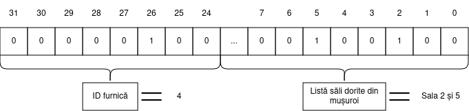

## Task 1 - Permissions (15p)

Pentru a strânge niște bani de buzunar și de călătorie, Zoly a acceptat un job la negru de la vecinele sale furnicile.

<div align="center">
    
</div>

Job-ul constă în crearea unei funcții care verifică dacă o anumită furnică are voie să rezerve sălile pe care le dorește din mușuroi.

Mușuroiul are 24 de săli, numerotate de la **0 la 23**.

Pentru a-i ușura treaba lui Zoly, aceasta are la dispoziție o listă în care se specifică sălile pe care fiecare furnică le poate rezerva.
Lista este reprezentată de vectorul global de întregi `ant_permissions[]`, aflat în fișierul `constants.h`. Acest vector poate fi accesat din fișierul `check_permission.asm` cu ajutorul label-ului `ant_permissions`.
Elementul de la poziția `i` din vector reprezintă lista de săli pe care furnica cu id-ul `i` le poate accesa.
Atunci când bitul `j` are valoarea `1` în elementul de la poziția `i`, furnica cu id-ul `i` poate accesa sala `j`.

**Observație** Din moment ce avem doar 24 de săli, asta înseamnă că cei mai semnificativi 8 biți ai fiecărui element din `employee_permissions[]` vor fi mereu 0.

Funcția pe care Zoly trebuie să o implementeze are antetul de mai jos.

```c
void check_permission(unsigned int n, unsigned int *res);
```

**Primul argument** (`n`) este un întreg pe 32 de biți.
Primii 8 cei mai semnificativi biți din cadrul numărului reprezintă identificatorul `i` al furnicii.
Restul de 24 de biți au următoarea semnificație: bitul `j` ne spune dacă furnica `i` dorește să rezerve sala `j`.
O furnică poate cere să rezerve mai multe săli simultan.
Figura de mai jos ilustrează formatul acestui argument.

<div align="center">
    
</div>


**Al doilea argument** (`res`) reprezintă adresa de memorie la care funcția trebuie să scrie rezultatul verificării. Dacă furnica cu identificatorul `i` poate rezerva toate sălile dorite, valoarea `1` trebuie scrisă la adresa `res`. Dacă furnica nu poate rezerva una sau mai multe din sălile dorite, valoarea `0` trebuie scrisă la adresa `res`.

Funcția trebuie completată în cadrul fișierului `check_permission.asm`.
