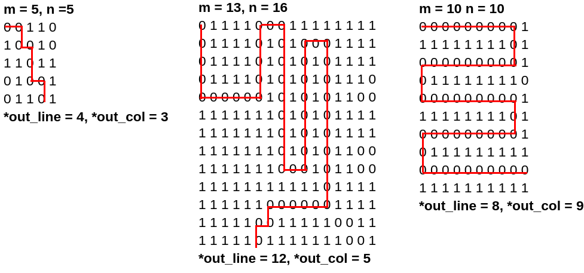
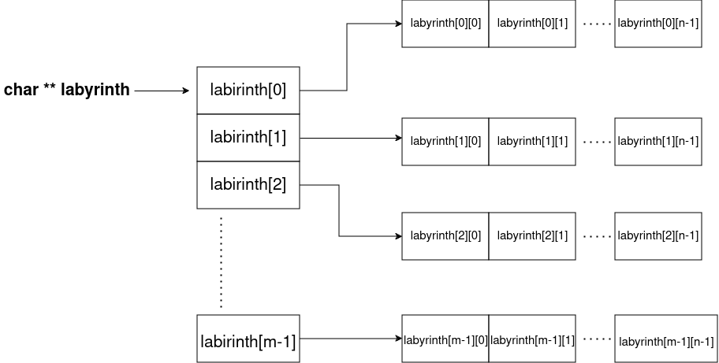

## Task 4 - Labyrinth (30p)
Suricata Zoly a ajuns acum și la ultima încercare: labirintul pus în calea ei de către ursul Maloo(ma).
Pentru a rezolva acest task, trebuie să o ajutați pe Zoly să găsească ieșirea din labirint,
rezolvând infama problemă **BDLP** (Break Dynamic Labyrinth Problem).

<div align="center">
    
</div>

Labirintul ursului Maloo(ma) are forma unui array bidimensional (o matrice) de caractere, alocat dinamic.
Codificarea labirintului este următoarea:
- Fiecare element din matrice reprezintă o celulă a labirintului.
- Atunci când valoarea unui element din matrice este `1` (cod ASCII `0x39`), acea celulă este reprezentată de un zid, iar Zoly nu se poate deplasa în ea.
- Atunci când valoarea unui element din matrice este `0` (cod ASCII `0x30`), acea celulă este liberă, iar Zoly se poate deplasa în ea.

Poziția suricatei în labirint este reprezentată mereu de o pereche (linie, coloană).
Dacă labirintul are `m` linii și `n` coloane, vom avea linii și coloane numerotate de la `0` la `m - 1`, respectiv de la `0` la `n - 1`.

Suricata va porni mereu din poziția `(0, 0)` și se poate deplasa în una din căsuțele vecine de sus, de jos, din dreapta sau din stânga.
Suricata nu se poate deplasa în diagonală.

Ieșirea din labirint este atinsă în momentul în care suricata reușește să ajungă pe linia `m - 1` sau pe coloana `n - 1` a labirintului.
Scopul nostru este să aflăm linia și coloana de ieșire din labirint.

Pentru simplificarea task-ului, ursul Maloo(ma) oferă următoarele garanții:
- **Din fiecare poziție curentă, suricata Zoly poate accesa doar poziția precedentă (lucru care trebuie evitat, pentru a nu se întoarce înapoi pe drum) și o singură poziție viitoare, restul căsuțelor vecine fiind ocupate de ziduri.**
- Labirintul are o singură rezolvare corectă.

Pentru acest task, va trebui să implementați în fișierul `labyrinth.asm` funcția `solve_labyrinth()`.

Antetul funcției este:

```c
void solve_labyrinth(unsigned int *out_line, unsigned int *out_col, unsigned int m, unsigned int n, char **labyrinth);
```

Semnificația argumentelor este:
- **out_line**: pointer la index-ul liniei corespunzătoare căsuței prin care suricata iese din labirint
- **out_col**: pointer la index-ul coloanei corespunzătoare căsuței prin care suricata iese din labirint
- **m**: numărul de linii din labirint
- **n**: numărul de coloane din labirint
- **labyrinth**: array-ul bidimensional, alocat dinamic, care conține reprezentarea labirintului

Codul vostru trebuie să rezolve labirintul și să salveze la adresa `out_line` index-ul liniei de ieșire, respectiv la adresa `out_col` index-ul coloanei de ieșire.

**HINT: Pentru a fi siguri că la niciun pas nu vă întoarceți în poziția precedentă (ceea ce vă poate aduce într-o buclă infinită), puteți marca mereu cu caracterul `1` poziția curentă înainte de a vă muta mai departe.**

Mai jos avem câteva exemple de labirint și de rezolvare a acestuia.



### Indicație

O matrice alocată dinamic are forma din figura de mai jos.
Spre deosebire de un array bidimensional alocat static, în acest caz nu putem garanta că liniile succesive din matrice vor fi plasate una în continuarea celeilalte în memorie, ci doar că fiecare linie este continuă în memorie.
Pentru mai multe detalii, puteți consulta și [această secțiune](https://github.com/systems-cs-pub-ro/iocla/tree/master/laborator/content/operatii-memorie-gdb#pointeri-la-tablouri) din laborator.



---
